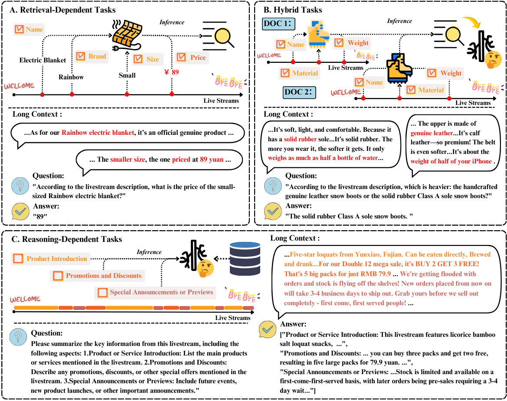

# LiveLongBench: Tackling Long-Context Understanding for Spoken Texts from Live Streams

## Overview
This repository contains code for our paper [LiveLongBench: Tackling Long-Context Understanding for Spoken Texts from Live Streams
]().  
> *Please find more details of this work in our paper.*

Long-context understanding poses significant challenges in natural language processing, particularly for real-world dialogues characterized by speech-based elements, high redundancy, and uneven information density. Although large language models (LLMs) achieve impressive results on existing benchmarks, these datasets fail to reflect the complexities of such texts, limiting their applicability to practical scenarios.

To bridge this gap, **LiveLongBench** introduces the first spoken long-text dataset derived from live streams, designed to reflect the redundancy-rich and conversational nature of real-world scenarios. The benchmark features tasks across three main categories:

- **Retrieval-dependent tasks**
- **Reasoning-dependent tasks**
- **Hybrid tasks**



We evaluate a variety of popular LLMs and specialized methods on this benchmark, revealing that current approaches struggle to process highly redundant texts effectively. Our findings indicate clear preferences for specific task types, with no single method excelling across all tasks. To address these challenges, we propose a simple yet strong baseline that significantly improves performance in processing spoken long-texts.

LiveLongBench serves as a valuable resource for advancing long-text understanding in real-world applications, particularly in e-commerce and live-streaming scenarios.

## Repository Structure
```
LiveLongBench/
├── data/                    # Dataset files and preprocessing scripts
├── data/results/            # Benchmarking results and evaluation outputs
├── scripts/                 # Scripts for running model evaluations
├── src/                     # Source code for model implementation and task evaluation
├── eval/                    # Code and resources for "needle-in-a-haystack" experiments
├── pipeline_passkey/        # Experimental pipeline for "needle-in-a-haystack" tasks
├── README.md                # Project documentation
```

## Getting Started
### 1. Clone the Repository
```bash
git clone https://github.com/Yarayx/livelongbench.git
cd livelongbench
```

### 2. Install Dependencies
We recommend setting up a virtual environment:
```bash
conda create -n livelongbench python=3.10
conda activate livelongbench
pip install -r requirements.txt
```

### 3. Running Model Evaluations
To evaluate different models on **LiveLongBench**, run the following script:
*Evaluate Local Models (e.g., LLaMA3.1-8B-Instruct)*
For local deployment of models such as LLaMA, run:
```bash
cd livelongbench
bash scripts/eval_llama31_full.sh
```
*Evaluate API-Based Models (e.g., GPT-4o)*
If you're using an API-based model like OpenAI's GPT-4o, set up your OPENAI key in config/models/gpt4o.yaml, and run:
```bash
cd livelongbench
bash scripts/eval_gpt4o.sh
```
Make sure you have properly configured your API keys and access before running API-based evaluation.

You can modify the existing scripts or create new ones under the scripts/ directory to test additional models, whether local or API-based.


## Dataset Access

A small sample of the dataset is included in this repository under the `data/livedata/` directory for demonstration purposes.

The full dataset is stored on Google Drive due to size and privacy considerations.

If you would like to access the complete dataset, please follow these steps:

1. **Complete the official [Application Form](./Data_Access_Form.pdf)** and ensure it is **hand-signed**.
2. Send the signed form to **[livelongbench@163.com](mailto:livelongbench@163.com)**.
3. After submission, request dataset access via the following link:

🔗 [Click here to request full dataset access](https://drive.google.com/drive/folders/1aWDSOwfeVCNnUqP0ZLo0vsC5soCAlssN?usp=drive_link)

We will review your application and grant access upon approval.

## 📖 Citation

If you find this repository useful, please consider citing our paper:
```
@misc{livelongbench,
      title={LiveLongBench: Tackling Long-Context Understanding for Spoken Texts from Live Streams}, 
      author={Yongxuan Wu and Runyu Chen and Peiyu Liu and Hongjin Qian},
      year={2025},
      eprint={2504.17366},
      archivePrefix={arXiv},
      primaryClass={cs.CL},
      url={https://arxiv.org/abs/2504.17366}, 
}
```
